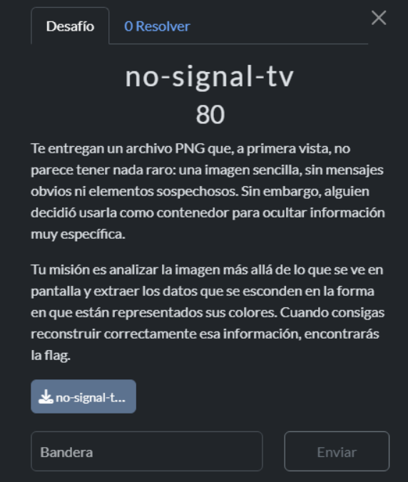
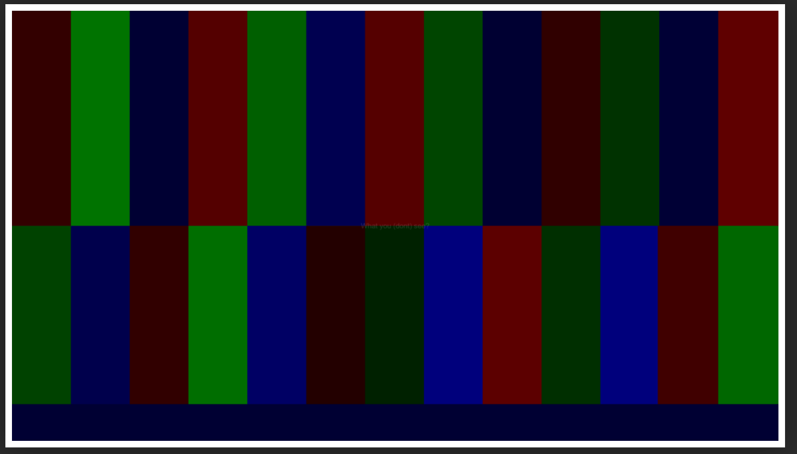
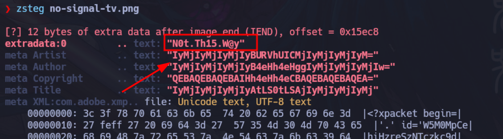

Nos daban esta imagen xd.




```python
❯ ls
 no-signal-tv.png

❯ file no-signal-tv.png
no-signal-tv.png: PNG image data, 4400 x 2475, 8-bit colormap, non-interlaced

❯ exiftool no-signal-tv.png
ExifTool Version Number         : 13.10
File Name                       : no-signal-tv.png
Directory                       : .
File Size                       : 90 kB
File Modification Date/Time     : 2025:11:28 14:37:46-05:00
File Access Date/Time           : 2025:11:28 14:37:52-05:00
File Inode Change Date/Time     : 2025:11:28 14:37:46-05:00
File Permissions                : -rw-rw-r--
File Type                       : PNG
File Type Extension             : png
MIME Type                       : image/png
Image Width                     : 4400
Image Height                    : 2475
Bit Depth                       : 8
Color Type                      : Palette
Compression                     : Deflate/Inflate
Filter                          : Adaptive
Interlace                       : Noninterlaced
Palette                         : (Binary data 243 bytes, use -b option to extract)
Transparency                    : (Binary data 81 bytes, use -b option to extract)
Artist                          : IyMjIyMjIyMjIyBURVhUICMjIyMjIyMjIyM=
Copyright                       : QEBAQEBAQEBAIHh4eHh4eCBAQEBAQEBAQEA=
XMP Toolkit                     : Image::ExifTool 13.25
Subject                         : JSUlJSUlJSUlJSBkZWMuICUlJSUlJSUlJSU=
Title                           : IyMjIyMjIyMjIyAtLS0tLSAjIyMjIyMjIyMj
Author                          : IyMjIyMjIyMjIyB4eHh4eHggIyMjIyMjIyMjIw=
Device                          : IyMjIyMjIyMjIyBnb2luZyAjIyMjIyMjIyMj
Camera Model                    : IyMjIyMjIyMjIyAtLS0tLSAjIyMjIyMjIyMj
Warning                         : [minor] Trailer data after PNG IEND chunk
Image Size                      : 4400x2475
Megapixels                      : 10.9
```

```python
❯ zsteg no-signal-tv.png

[?] 12 bytes of extra data after image end (IEND), offset = 0x15ec8
extradata:0         .. text: "N0t.Th15.W@y"
meta Artist         .. text: "IyMjIyMjIyMjIyBURVhUICMjIyMjIyMjIyM="
meta Author         .. text: "IyMjIyMjIyMjIyB4eHh4eHggIyMjIyMjIyMjIw="
meta Copyright      .. text: "QEBAQEBAQEBAIHh4eHh4eCBAQEBAQEBAQEA="
meta Title          .. text: "IyMjIyMjIyMjIyAtLS0tLSAjIyMjIyMjIyMj"
meta XML:com.adobe.xmp.. file: Unicode text, UTF-8 text
    00000000: 3c 3f 78 70 61 63 6b 65  74 20 62 65 67 69 6e 3d  |<?xpacket begin=|
    00000010: 27 feff 27 20 69 64 3d 27  57 35 4d 30 4d 70 43 65  |'.' id='W5M0MpCe|
    00000020: 68 69 48 7a 72 65 53 7a  4e 54 63 7a 6b 63 39 64  |hiHzreSzNTczkc9d|
    00000030: 27 3f 3e 0a 3c 78 3a 78  6d 70 6d 65 74 61 20 78  |'?>.<x:xmpmeta x|
    00000040: 6d 6c 6e 73 3a 78 3d 27  61 64 6f 62 65 3a 6e 73  |mlns:x='adobe:ns|
    00000050: 3a 6d 65 74 61 2f 27 20  78 3a 78 6d 70 74 6b 3d  |:meta/' x:xmptk=|
    00000060: 27 49 6d 61 67 65 3a 3a  45 78 69 66 54 6f 6f 6c  |'Image::ExifTool|
    00000070: 20 31 33 2e 32 35 27 3e  0a 3c 72 64 66 3a 52 44  | 13.25'>.<rdf:RD|
    00000080: 46 20 78 6d 6c 6e 73 3a  72 64 66 3d 27 68 74 74  |F xmlns:rdf='htt|
    00000090: 70 3a 2f 2f 77 77 77 2e  77 33 2e 6f 72 67 2f 31  |p://www.w3.org/1|
    000000a0: 39 39 39 2f 30 32 2f 32  32 2d 72 64 66 2d 73 79  |999/02/22-rdf-sy|
    000000b0: 6e 74 61 78 2d 6e 73 23  27 3e 0a 0a 20 3c 72 64  |ntax-ns#'>.. <rd|
    000000c0: 66 3a 44 65 73 63 72 69  70 74 69 6f 6e 20 72 64  |f:Description rd|
    000000d0: 66 3a 61 62 6f 75 74 3d  27 27 0a 20 20 78 6d 6c  |f:about=''.  xml|
    000000e0: 6e 73 3a 64 63 3d 27 68  74 74 70 3a 2f 2f 70 75  |ns:dc='http://pu|
    000000f0: 72 6c 2e 6f 72 67 2f 64  63 2f 65 6c 65 6d 65 6e  |rl.org/dc/elemen|
imagedata           .. text: ["\t" repeated 339 times]
b3,bgr,lsb,xy       .. file: MIPSEB Ucode
b4,g,lsb,xy         .. text: ["3" repeated 87 times
```

Ese no es el camino nos dice. Es decir: **no debíamos buscar la flag en los metadata.**



Intenté un montón de cosas pero al final solo era tirar por el método manual.

Entrabamos en esta página y íbamos sacando el code de cada color uno por uno jeje ;( .
https://colorpickerfromimage.com/

Una vez sacado toda la lista de colores y su respectivo código crafteabamos este script.


```python
# Lista completa de colores en formato (R, G, B)
colors = [
    (51, 0, 0),    # #330000
    (0, 115, 0),   # #007300
    (0, 0, 51),    # #000033
    (84, 0, 0),    # #540000
    (0, 95, 0),    # #005f00
    (0, 0, 80),    # #000050
    (85, 0, 0),    # #550000
    (0, 69, 0),    # #004500
    (0, 0, 50),    # #000032
    (48, 0, 0),    # #300000
    (0, 50, 0),    # #003200
    (0, 0, 53),    # #000035
    (95, 0, 0),    # #5f0000
    (0, 66, 0),    # #004200
    (0, 0, 76),    # #00004c
    (49, 0, 0),    # #310000
    (0, 110, 0),   # #006e00
    (0, 0, 100),   # #000064
    (35, 0, 0),    # #230000
    (0, 33, 0),    # #002100
    (0, 0, 124),   # #00007c
    (92, 0, 0),    # #5c0000
    (0, 47, 0),    # #002f00
    (0, 0, 124),   # #00007c
    (64, 0, 0),    # #400000
    (0, 103, 0),   # #006700
    (0, 0, 51)     # #000033
]

# Función para obtener el valor activo (el que no es 0)
def active_channel_value(rgb):
    r, g, b = rgb
    if r != 0:
        return r
    elif g != 0:
        return g
    elif b != 0:
        return b
    return 0

# Convertir cada color a ASCII usando el canal activo
ascii_chars = [chr(active_channel_value(c)) for c in colors]

# Concatenar todos los caracteres
flag = ''.join(ascii_chars)

print("Flag reconstruida:")
print(flag)
```

```
3s3T_PUE2025_BL1nd#!|\/|@g3
```

PSDT: No me boten p :´v

xd

