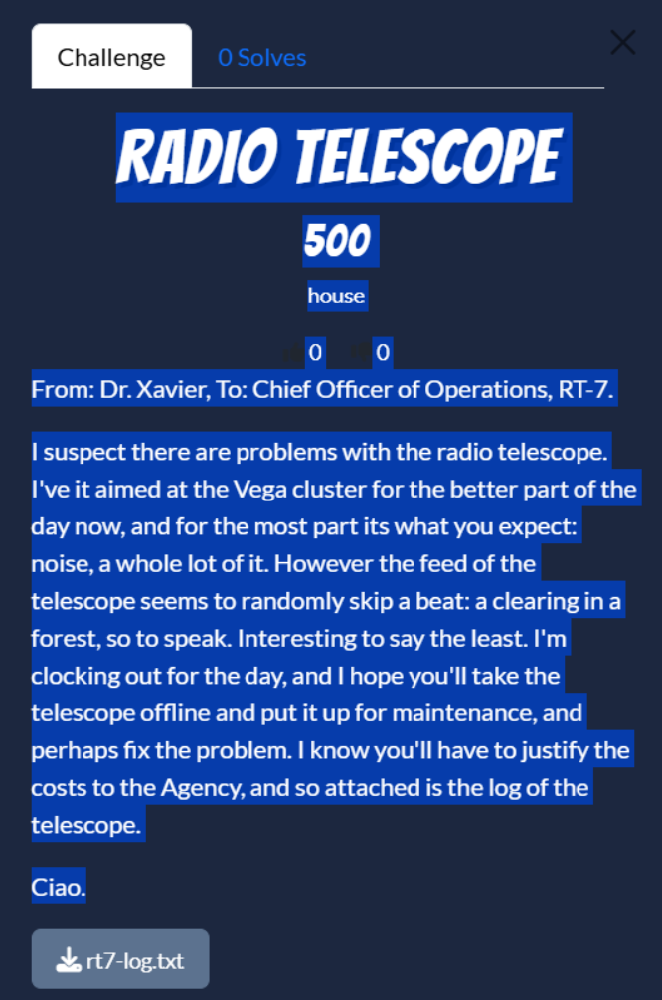
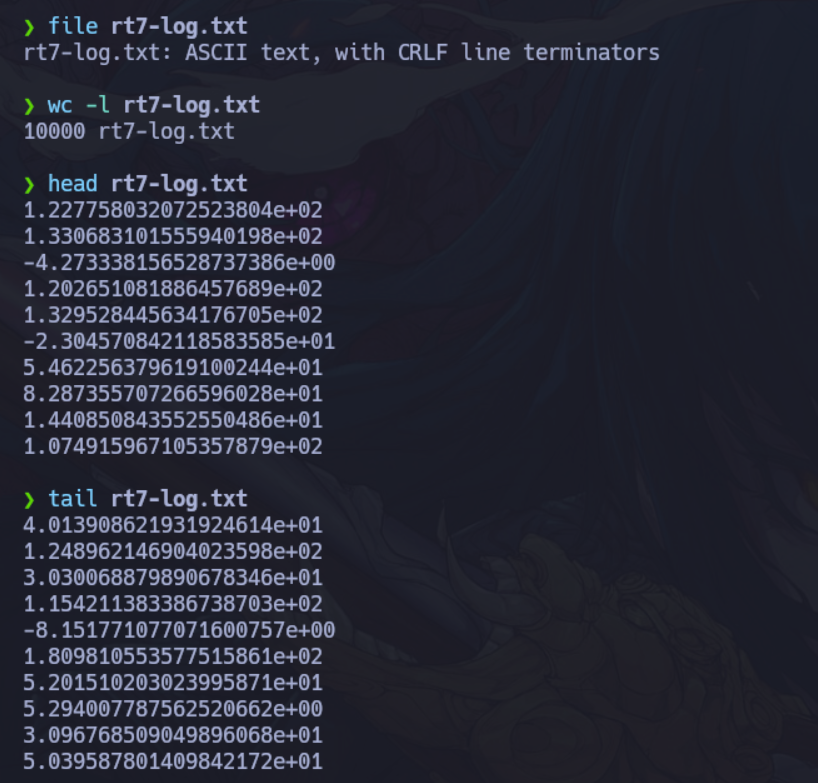
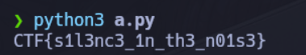

Script pa sacar la flag.

```python
last_val = 0
count = 0
flag = ""

with open("rt7-log.txt") as f:
    for line in f:
        val = round(float(line.strip()))
        if val == last_val:
            count += 1
        else:
            if count > 5:
                flag += chr(last_val)
            count = 1
            last_val = val
print(flag)
```



---

Este reto de la categoría "Misc" (Miscelánea) utiliza una técnica común en esteganografía: ocultar información dentro de ruido o datos aparentemente aleatorios.

El mensaje del Dr. Xavier menciona que el telescopio está captando mayormente "ruido", pero que "aleatoriamente salta un latido: un claro en el bosque". Esto sugiere que la mayoría de los números en el archivo `rt7-log.txt` son aleatorios, pero hay secuencias específicas que forman algo coherente.

Al observar el contenido de `rt7-log.txt`, verás largas listas de números decimales. Sin embargo, si prestas atención, hay tramos donde los números se vuelven sospechosamente constantes o repetitivos por así decirlo:

- **Ejemplo de "Claro en el bosque" 1:** Entre las líneas 76 y 79, los números se mantienen casi idénticos alrededor de **66.9** o **67**.
- **Ejemplo de "Claro en el bosque" 2:** Entre las líneas 152 y 156, los números se estabilizan cerca de **84**.
- **Ejemplo de "Claro en el bosque" 3:** Entre las líneas 229 y 233, los números rondan el **70**.

Cuando ves números decimales en un rango de 32 a 126, suelen representar caracteres **ASCII**. Si aislamos estos "claros" (los valores constantes), obtenemos lo siguiente:

1. Primer bloque constante: **~67** → Carácter ASCII: **C**
2. Segundo bloque constante: **~84** → Carácter ASCII: **T**
3. Tercer bloque constante: **~70** → Carácter ASCII: **F**
4. Cuarto bloque constante (líneas 306-310): **~123** → Carácter ASCII: **{**
5. Quinto bloque constante (líneas 383-386): **~115** → Carácter ASCII: **s**
6. Sexto bloque constante (líneas 460-463): **~49** → Carácter ASCII: **1**


El script para resolverlo que se vio arriba consta de estos pasos.

1. Leer el archivo línea por línea.
2. Comparar el número actual con el anterior.
3. Si un número se repite exactamente (o con una variación mínima) más de 3 o 4 veces seguidas, tómalo como un carácter de la bandera.
4. Convertir esos valores de punto flotante a enteros y luego a caracteres ASCII.


