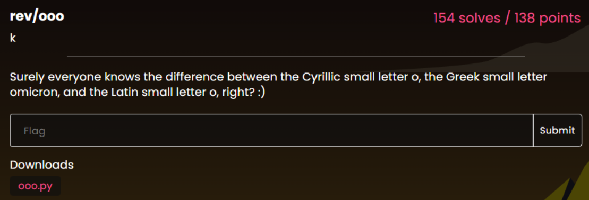
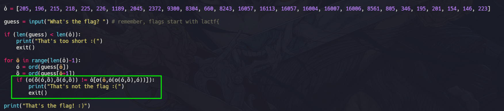
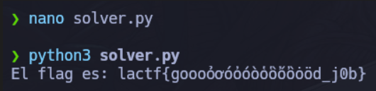

Vemos como en el script que nos dan, cada función usa una "o" distinta.

```python
❯ /usr/bin/cat ooo.py
def о(a, b):
    return a+b
def ο(a, b):
    return a-b
def օ(a, b):
    return a*b
def ỏ(a, b):
    return a//b
def ơ(a, b):
    return a^b
def ó(a, b):
    return a|b
def ὀ(a, b):
    return a&b
def ὸ(a, b):
    return b-a
def ὄ(a, b):
    return a
def ὂ(a, b):
    return b
def ȯ(a, b):
    return a % b
    

ὁ = [205, 196, 215, 218, 225, 226, 1189, 2045, 2372, 9300, 8304, 660, 8243, 16057, 16113, 16057, 16004, 16007, 16006, 8561, 805, 346, 195, 201, 154, 146, 223]

guess = input("What's the flag? ") # remember, flags start with lactf{

if (len(guess) < len(ὁ)):
    print("That's too short :(")
    exit()
    
for ö in range(len(ὁ)-1):
    ό = ord(guess[ö])
    ὃ = ord(guess[ö+1])
    if (о(ὄ(ό,ὃ),ὂ(ό,ὃ)) != ὁ[ơ(ö,ȯ(օ(ό,ὃ),ό))]):
        print("That's not the flag :(")
        exit()
    
print("That's the flag! :)")
```

Cada "o" hace una operación y lo retorna. Si decimos a la IA para que nos analicé los tipos de "o" tendremos esto.

| **Carácter** | **Nombre Unicode**                              |
| ------------ | ----------------------------------------------- |
| **`о`**      | Cyrillic Small Letter O                         |
| **`ο`**      | Greek Small Letter Omicron                      |
| **`օ`**      | Armenian Small Letter Yiw                       |
| **`ỏ`**      | Latin Small Letter O with Hook Above            |
| **`ơ`**      | Latin Small Letter O with Horn                  |
| **`ó`**      | Latin Small Letter O with Acute                 |
| **`ὀ`**      | Greek Small Letter Omicron with Psili           |
| **`ὸ`**      | Greek Small Letter Omicron with Varia           |
| **`ὄ`**      | Greek Small Letter Omicron with Psili and Oxia  |
| **`ὂ`**      | Greek Small Letter Omicron with Psili and Varia |
| **`ȯ`**      | Latin Small Letter O with Dot Above             |

Vemos la lógica y esto está raro creo gigiri gigiri gigiri.



Si reemplazamos los homógrafos por sus funciones reales:

- `о(a, b)` es `a + b`
- `ὄ(ό, ὃ)` devuelve `ό` (carácter actual)
- `ὂ(ό, ὃ)` devuelve `ὃ` (carácter siguiente)
- `ơ(...)` es un **XOR** (`^`)
- `ȯ(...)` es un **módulo** (`%`)
- `օ(...)` es una **multiplicación** (`*`)

La ecuación se simplifica a: **`ord(guess[i]) + ord(guess[i+1]) == ὁ[i ^ ((ord(guess[i]) * ord(guess[i+1])) % ord(guess[i]))]`**

Pepepepero`(A * B) % A` siempre es **0**. Por lo tanto, la parte de la derecha se simplifica drásticamente: `i ^ 0` es simplemente `i`.

**La ecuación final es:**
> `ord(guess[i]) + ord(guess[i+1]) = ὁ[i]`

Como nos dicen que el flag empieza con `lactf{`, podemos ir despejando el siguiente carácter uno a uno. `ord(guess[i+1]) = ὁ[i] - ord(guess[i])`

```python
ὁ = [205, 196, 215, 218, 225, 226, 1189, 2045, 2372, 9300, 8304, 660, 8243, 16057, 16113, 16057, 16004, 16007, 16006, 8561, 805, 346, 195, 201, 154, 146, 223]

flag = "l" # Conocemos el primer caracter

for i in range(len(ὁ)):
    # La suma de flag[i] + flag[i+1] es igual a ὁ[i]
    # Por lo tanto: flag[i+1] = ὁ[i] - flag[i]
    next_char_code = ὁ[i] - ord(flag[i])
    flag += chr(next_char_code)

print(f"El flag es: {flag}")
```




