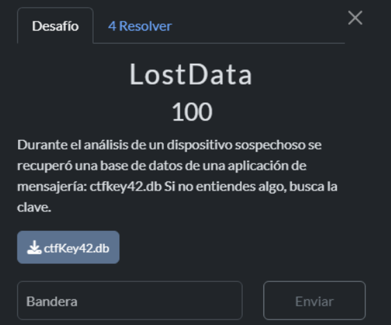
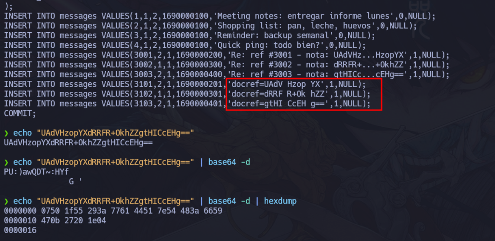
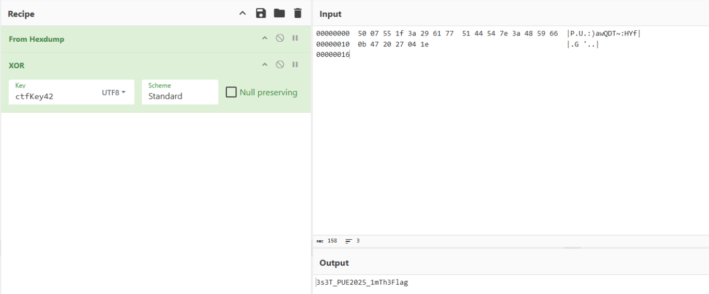

```python
❯ ls -l ctfKey42.db
.rw-rw-r-- kali kali 16 KB Fri Nov 28 14:16:31 2025  ctfKey42.db

❯ file ctfKey42.db
ctfKey42.db: SQLite 3.x database, last written using SQLite version 3040001, writer version 2, read version 2, file counter 2, database pages 4, cookie 0x3, schema 4, UTF-8, version-valid-for 2

❯ sqlite3 ctfKey42.db ".tables"
media_files  messages     users      

❯ sqlite3 ctfKey42.db ".schema"
CREATE TABLE users (
  id INTEGER PRIMARY KEY,
  username TEXT,
  phone TEXT
);
CREATE TABLE media_files (
  id INTEGER PRIMARY KEY,
  filename TEXT,
  mime TEXT
);
CREATE TABLE messages (
  id INTEGER PRIMARY KEY,
  sender_id INTEGER,
  receiver_id INTEGER,
  timestamp INTEGER,
  content TEXT,
  deleted INTEGER DEFAULT 0,
  media_id INTEGER
);
  
```

```python
❯ sqlite3 ctfKey42.db ".dump"
PRAGMA foreign_keys=OFF;
BEGIN TRANSACTION;
CREATE TABLE users (
  id INTEGER PRIMARY KEY,
  username TEXT,
  phone TEXT
);
INSERT INTO users VALUES(1,'alice','+549-67-116-102');
INSERT INTO users VALUES(2,'bad_actor','+549222222222');
CREATE TABLE media_files (
  id INTEGER PRIMARY KEY,
  filename TEXT,
  mime TEXT
);
CREATE TABLE messages (
  id INTEGER PRIMARY KEY,
  sender_id INTEGER,
  receiver_id INTEGER,
  timestamp INTEGER,
  content TEXT,
  deleted INTEGER DEFAULT 0,
  media_id INTEGER
);
INSERT INTO messages VALUES(1,1,2,1690000100,'Meeting notes: entregar informe lunes',0,NULL);
INSERT INTO messages VALUES(2,1,2,1690000100,'Shopping list: pan, leche, huevos',0,NULL);
INSERT INTO messages VALUES(3,1,2,1690000100,'Reminder: backup semanal',0,NULL);
INSERT INTO messages VALUES(4,1,2,1690000100,'Quick ping: todo bien?',0,NULL);
INSERT INTO messages VALUES(3001,2,1,1690000200,'Re: ref #3001 - nota: UAdVHz...HzopYX',1,NULL);
INSERT INTO messages VALUES(3002,1,1,1690000300,'Re: ref #3002 - nota: dRRFR+...+OkhZZ',1,NULL);
INSERT INTO messages VALUES(3003,2,1,1690000400,'Re: ref #3003 - nota: gtHICc...cEHg==',1,NULL);
INSERT INTO messages VALUES(3101,2,1,1690000201,'docref=UAdV Hzop YX',1,NULL);
INSERT INTO messages VALUES(3102,1,1,1690000301,'docref=dRRF R+Ok hZZ',1,NULL);
INSERT INTO messages VALUES(3103,2,1,1690000401,'docref=gtHI CcEH g==',1,NULL);
COMMIT;
```




>-C es para mostrar en modo canonical
>Incluye las 3 columnas por así decirlo: Offset , hex, ASCII




