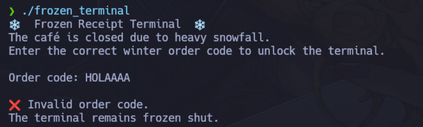
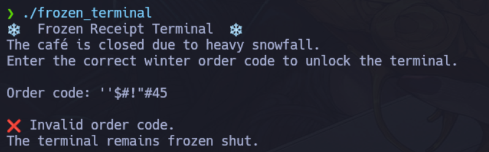
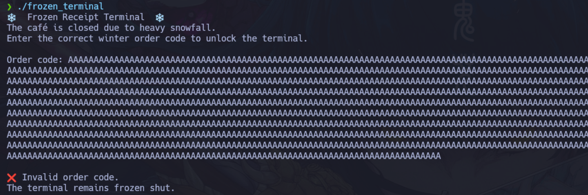
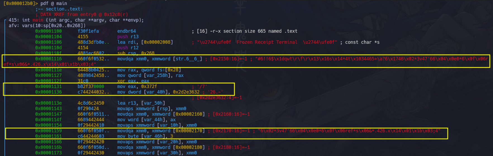
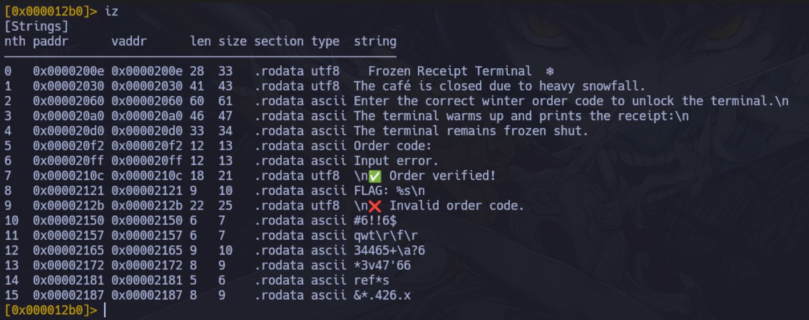
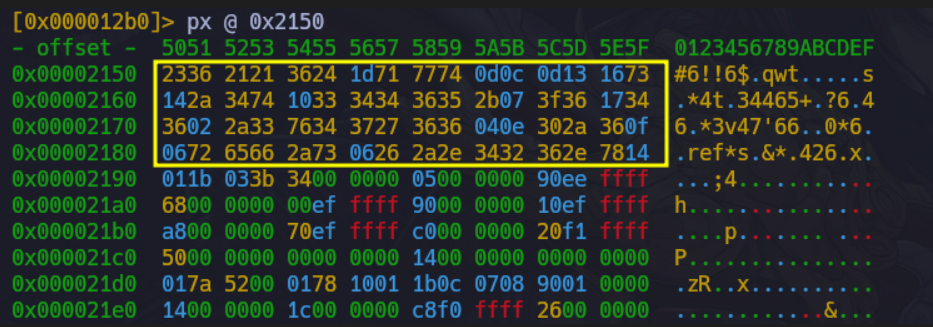
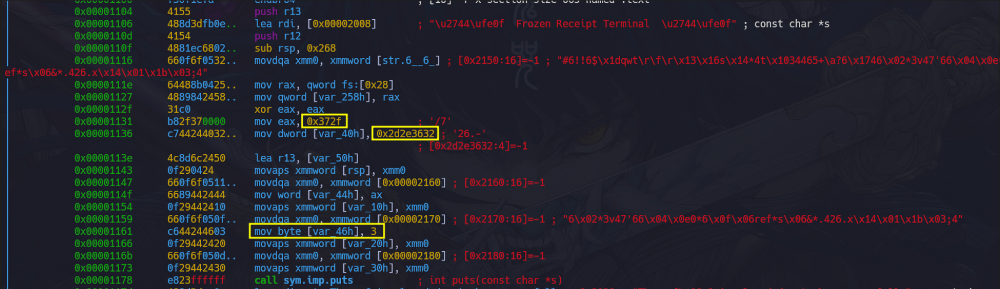
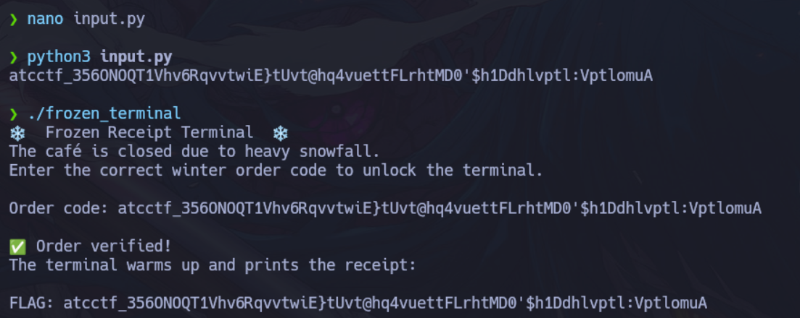

De primeras nos daban un binario.

Si no ponemos el Order code correcto siempre nos dará el mensaje *The terminal frozen shut*.





Vemos si es que puede ser un posible buffer overflow, pero pareciera que no.



Abrimos **radare2** xd.

```python
❯ r2 -A frozen_terminal

WARN: Relocs has not been applied. Please use `-e bin.relocs.apply=true` or `-e bin.cache=true` next time
INFO: Analyze all flags starting with sym. and entry0 (aa)
INFO: Analyze imports (af@@@i)
INFO: Analyze entrypoint (af@ entry0)
INFO: Analyze symbols (af@@@s)
INFO: Analyze all functions arguments/locals (afva@@@F)
INFO: Analyze function calls (aac)
INFO: Analyze len bytes of instructions for references (aar)
INFO: Finding and parsing C++ vtables (avrr)
INFO: Analyzing methods (af @@ method.*)
INFO: Recovering local variables (afva@@@F)
INFO: Type matching analysis for all functions (aaft)
INFO: Propagate noreturn information (aanr)
INFO: Use -AA or aaaa to perform additional experimental analysis
[0x000012b0]> pdf @ main
            ;-- section..text:
            ; DATA XREF from entry0 @ 0x12c8(r)
┌ 415: int main (int argc, char **argv, char **envp);
│ afv: vars(10:sp[0x20..0x268])
│           0x00001100      f30f1efa       endbr64                     ; [16] -r-x section size 665 named .text
│           0x00001104      4155           push r13
│           0x00001106      488d3dfb0e..   lea rdi, [0x00002008]       ; "\u2744\ufe0f  Frozen Receipt Terminal  \u2744\ufe0f" ; const char *s
│           0x0000110d      4154           push r12
│           0x0000110f      4881ec6802..   sub rsp, 0x268
│           0x00001116      660f6f0532..   movdqa xmm0, xmmword [str.6__6_] ; [0x2150:16]=-1 ; "#6!!6$\x1dqwt\r\f\r\x13\x16s\x14*4t\x1034465+\a?6\x1746\x02*3v47'66\x04\x0e0*6\x0f\x06ref*s\x06&*.426.x\x14\x01\x1b\x03;4"
│           0x0000111e      64488b0425..   mov rax, qword fs:[0x28]
│           0x00001127      4889842458..   mov qword [var_258h], rax
│           0x0000112f      31c0           xor eax, eax
│           0x00001131      b82f370000     mov eax, 0x372f             ; '/7'
│           0x00001136      c744244032..   mov dword [var_40h], 0x2d2e3632 ; '26.-'
│                                                                      ; [0x2d2e3632:4]=-1
│           0x0000113e      4c8d6c2450     lea r13, [var_50h]
│           0x00001143      0f290424       movaps xmmword [rsp], xmm0
│           0x00001147      660f6f0511..   movdqa xmm0, xmmword [0x00002160] ; [0x2160:16]=-1
│           0x0000114f      6689442444     mov word [var_44h], ax
│           0x00001154      0f29442410     movaps xmmword [var_10h], xmm0
│           0x00001159      660f6f050f..   movdqa xmm0, xmmword [0x00002170] ; [0x2170:16]=-1 ; "6\x02*3v47'66\x04\x0e0*6\x0f\x06ref*s\x06&*.426.x\x14\x01\x1b\x03;4"
│           0x00001161      c644244603     mov byte [var_46h], 3
│           0x00001166      0f29442420     movaps xmmword [var_20h], xmm0
│           0x0000116b      660f6f050d..   movdqa xmm0, xmmword [0x00002180] ; [0x2180:16]=-1
│           0x00001173      0f29442430     movaps xmmword [var_30h], xmm0
│           0x00001178      e823ffffff     call sym.imp.puts           ; int puts(const char *s)
│           0x0000117d      488d3dac0e..   lea rdi, str.The_caf_is_closed_due_to_heavy_snowfall. ; 0x2030 ; "The caf\u00e9 is closed due to heavy snowfall." ; const char *s
│           0x00001184      e817ffffff     call sym.imp.puts           ; int puts(const char *s)
│           0x00001189      488d3dd00e..   lea rdi, str.Enter_the_correct_winter_order_code_to_unlock_the_terminal._n ; 0x2060 ; "Enter the correct winter order code to unlock the terminal.\n" ; const char *s
│           0x00001190      e80bffffff     call sym.imp.puts           ; int puts(const char *s)
│           0x00001195      488d35560f..   lea rsi, str.Order_code:    ; 0x20f2 ; "Order code: "
│           0x0000119c      bf01000000     mov edi, 1
│           0x000011a1      31c0           xor eax, eax
│           0x000011a3      e848ffffff     call sym.imp.__printf_chk
│           0x000011a8      488b15612e..   mov rdx, qword [obj.stdin]  ; [0x4010:8]=0 ; FILE *stream
│           0x000011af      be00010000     mov esi, 0x100              ; int size
│           0x000011b4      4c89ef         mov rdi, r13                ; char *s
│           0x000011b7      e814ffffff     call sym.imp.fgets          ; char *fgets(char *s, int size, FILE *stream)
│           0x000011bc      4885c0         test rax, rax
│       ┌─< 0x000011bf      0f84c7000000   je 0x128c
│       │   0x000011c5      488d355d0f..   lea rsi, [0x00002129]       ; "\n" ; const char *s2
│       │   0x000011cc      4c89ef         mov rdi, r13                ; const char *s1
│       │   0x000011cf      4c8da42450..   lea r12, [var_150h]
│       │   0x000011d7      e8e4feffff     call sym.imp.strcspn        ; size_t strcspn(const char *s1, const char *s2)
│       │   0x000011dc      ba23000000     mov edx, 0x23               ; '#'
│       │   0x000011e1      c644045000     mov byte [rsp + rax + 0x50], 0
│       │   0x000011e6      31c0           xor eax, eax
│      ┌──< 0x000011e8      eb0a           jmp 0x11f4
..
│      ││   ; CODE XREF from main @ 0x1203(x)
│     ┌───> 0x000011f0      0fb61404       movzx edx, byte [rsp + rax]
│     ╎││   ; CODE XREF from main @ 0x11e8(x)
│     ╎└──> 0x000011f4      83f242         xor edx, 0x42
│     ╎ │   0x000011f7      41881404       mov byte [r12 + rax], dl
│     ╎ │   0x000011fb      4883c001       add rax, 1
│     ╎ │   0x000011ff      4883f847       cmp rax, 0x47               ; 'G'
│     └───< 0x00001203      75eb           jne 0x11f0
│       │   0x00001205      4c89ee         mov rsi, r13                ; const char *s2
│       │   0x00001208      4c89e7         mov rdi, r12                ; const char *s1
│       │   0x0000120b      c684249701..   mov byte [var_197h], 0
│       │   0x00001213      e8c8feffff     call sym.imp.strcmp         ; int strcmp(const char *s1, const char *s2)
│       │   0x00001218      4189c5         mov r13d, eax
│       │   0x0000121b      85c0           test eax, eax
│      ┌──< 0x0000121d      743d           je 0x125c
│      ││   0x0000121f      488d3d050f..   lea rdi, str._n_Invalid_order_code. ; 0x212b ; "\n\u274c Invalid order code." ; const char *s
│      ││   0x00001226      4531ed         xor r13d, r13d
│      ││   0x00001229      e872feffff     call sym.imp.puts           ; int puts(const char *s)
│      ││   0x0000122e      488d3d9b0e..   lea rdi, str.The_terminal_remains_frozen_shut. ; 0x20d0 ; "The terminal remains frozen shut." ; const char *s
│      ││   0x00001235      e866feffff     call sym.imp.puts           ; int puts(const char *s)
│      ││   ; CODE XREFS from main @ 0x128a(x), 0x129e(x)
│    ┌┌───> 0x0000123a      488b842458..   mov rax, qword [var_258h]
│    ╎╎││   0x00001242      64482b0425..   sub rax, qword fs:[0x28]
│   ┌─────< 0x0000124b      7553           jne 0x12a0
│   │╎╎││   0x0000124d      4881c46802..   add rsp, 0x268
│   │╎╎││   0x00001254      4489e8         mov eax, r13d
│   │╎╎││   0x00001257      415c           pop r12
│   │╎╎││   0x00001259      415d           pop r13
│   │╎╎││   0x0000125b      c3             ret
│   │╎╎││   ; CODE XREF from main @ 0x121d(x)
│   │╎╎└──> 0x0000125c      488d3da90e..   lea rdi, str._n_Order_verified_ ; 0x210c ; "\n\u2705 Order verified!" ; const char *s
│   │╎╎ │   0x00001263      e838feffff     call sym.imp.puts           ; int puts(const char *s)
│   │╎╎ │   0x00001268      488d3d310e..   lea rdi, str.The_terminal_warms_up_and_prints_the_receipt:_n ; 0x20a0 ; "The terminal warms up and prints the receipt:\n" ; const char *s
│   │╎╎ │   0x0000126f      e82cfeffff     call sym.imp.puts           ; int puts(const char *s)
│   │╎╎ │   0x00001274      4c89e2         mov rdx, r12
│   │╎╎ │   0x00001277      bf01000000     mov edi, 1
│   │╎╎ │   0x0000127c      31c0           xor eax, eax
│   │╎╎ │   0x0000127e      488d359c0e..   lea rsi, str.FLAG:__s_n     ; 0x2121 ; "FLAG: %s\n"
│   │╎╎ │   0x00001285      e866feffff     call sym.imp.__printf_chk
│   │└────< 0x0000128a      ebae           jmp 0x123a
│   │ ╎ │   ; CODE XREF from main @ 0x11bf(x)
│   │ ╎ └─> 0x0000128c      488d3d6c0e..   lea rdi, str.Input_error.   ; 0x20ff ; "Input error." ; const char *s
│   │ ╎     0x00001293      41bd01000000   mov r13d, 1
│   │ ╎     0x00001299      e802feffff     call sym.imp.puts           ; int puts(const char *s)
│   │ └───< 0x0000129e      eb9a           jmp 0x123a
│   │       ; CODE XREF from main @ 0x124b(x)
└   └─────> 0x000012a0      e80bfeffff     call sym.imp.__stack_chk_fail ; void __stack_chk_fail(void)
```

Esta sería como que la sección importante:

```python
0x000011f0      movzx edx, byte [rsp + rax]   ; leer input[i]
0x000011f4      xor edx, 0x42                 ; 🔥 TRANSFORMACIÓN
**0x000011f7**      mov byte [r12 + rax], dl      ; guardar transformado
0x000011fb      add rax, 1
0x000011ff      cmp rax, 0x47                 ; 71 bytes
jne 0x11f0
```

**¿Qué hace esto?**

El programa hace **XOR con 0x42 a TODO el input**.

Entonces

`cmp rax, 0x47`

0x47 = **71 bytes**

> El código correcto debe medir **71 caracteres**.

Vemos como **strcmp** compara \*s1 con \*s2, por lo que compara **mov rdi, r12** con **mov rsi, r13**.

```python
│       │   0x00001205      4c89ee         mov rsi, r13                ; const char *s2
│       │   0x00001208      4c89e7         mov rdi, r12                ; const char *s1
│       │   0x0000120b      c684249701..   mov byte [var_197h], 0
│       │   0x00001213      e8c8feffff     call sym.imp.strcmp         ; int strcmp(const char *s1, const char *s2)
```
El buffer secreto salió arriba en `main`.



Ahí se están cargando **bytes crudos** a la pila.
Eso es el **flag pero XOR-eado**.

Sabemos que el programa hace:

> input XOR 0x42=secreto

Entonces:

> input=secreto XOR 0x42

Entonces el XOR es reversible.

Sacamos los bytes en hexadecimal.


```python
[0x000012b0]> iz
[Strings]
nth paddr      vaddr      len size section type  string
―――――――――――――――――――――――――――――――――――――――――――――――――――――――
0   0x0000200e 0x0000200e 28  33   .rodata utf8    Frozen Receipt Terminal  ❄
1   0x00002030 0x00002030 41  43   .rodata utf8  The café is closed due to heavy snowfall.
2   0x00002060 0x00002060 60  61   .rodata ascii Enter the correct winter order code to unlock the terminal.\n
3   0x000020a0 0x000020a0 46  47   .rodata ascii The terminal warms up and prints the receipt:\n
4   0x000020d0 0x000020d0 33  34   .rodata ascii The terminal remains frozen shut.
5   0x000020f2 0x000020f2 12  13   .rodata ascii Order code:
6   0x000020ff 0x000020ff 12  13   .rodata ascii Input error.
7   0x0000210c 0x0000210c 18  21   .rodata utf8  \n✅ Order verified!
8   0x00002121 0x00002121 9   10   .rodata ascii FLAG: %s\n
9   0x0000212b 0x0000212b 22  25   .rodata utf8  \n❌ Invalid order code.
10  0x00002150 0x00002150 6   7    .rodata ascii #6!!6$
11  0x00002157 0x00002157 6   7    .rodata ascii qwt\r\f\r
12  0x00002165 0x00002165 9   10   .rodata ascii 34465+\a?6
13  0x00002172 0x00002172 8   9    .rodata ascii *3v47'66
14  0x00002181 0x00002181 5   6    .rodata ascii ref*s
15  0x00002187 0x00002187 8   9    .rodata ascii &*.426.x
```

```python
[0x000012b0]> px @ 0x2150
- offset -  5051 5253 5455 5657 5859 5A5B 5C5D 5E5F  0123456789ABCDEF
0x00002150  2336 2121 3624 1d71 7774 0d0c 0d13 1673  #6!!6$.qwt.....s
0x00002160  142a 3474 1033 3434 3635 2b07 3f36 1734  .*4t.34465+.?6.4
0x00002170  3602 2a33 7634 3727 3636 040e 302a 360f  6.*3v47'66..0*6.
0x00002180  0672 6566 2a73 0626 2a2e 3432 362e 7814  .ref*s.&*.426.x.
0x00002190  011b 033b 3400 0000 0500 0000 90ee ffff  ...;4...........
0x000021a0  6800 0000 00ef ffff 9000 0000 10ef ffff  h...............
0x000021b0  a800 0000 70ef ffff c000 0000 20f1 ffff  ....p....... ...
0x000021c0  5000 0000 0000 0000 1400 0000 0000 0000  P...............
0x000021d0  017a 5200 0178 1001 1b0c 0708 9001 0000  .zR..x..........
0x000021e0  1400 0000 1c00 0000 c8f0 ffff 2600 0000  ............&...
0x000021f0  0044 0710 0000 0000 2400 0000 3400 0000  .D......$...4...
0x00002200  20ee ffff 7000 0000 000e 1046 0e18 4a0f   ...p......F..J.
0x00002210  0b77 0880 003f 1a3a 2a33 2422 0000 0000  .w...?.:*3$"....
0x00002220  1400 0000 5c00 0000 68ee ffff 1000 0000  ....\...h.......
0x00002230  0000 0000 0000 0000 1400 0000 7400 0000  ............t...
0x00002240  60ee ffff 6000 0000 0000 0000 0000 0000  `...`...........
[0x000012b0]> px 80 @ 0x2150
- offset -  5051 5253 5455 5657 5859 5A5B 5C5D 5E5F  0123456789ABCDEF
0x00002150  2336 2121 3624 1d71 7774 0d0c 0d13 1673  #6!!6$.qwt.....s
0x00002160  142a 3474 1033 3434 3635 2b07 3f36 1734  .*4t.34465+.?6.4
0x00002170  3602 2a33 7634 3727 3636 040e 302a 360f  6.*3v47'66..0*6.
0x00002180  0672 6566 2a73 0626 2a2e 3432 362e 7814  .ref*s.&*.426.x.
0x00002190  011b 033b 3400 0000 0500 0000 90ee ffff  ...;4...........
[0x000012b0]> 
```







```python
data = bytes([
0x23,0x36,0x21,0x21,0x36,0x24,0x1d,0x71,0x77,0x74,0x0d,0x0c,0x0d,0x13,0x16,0x73,
0x14,0x2a,0x34,0x74,0x10,0x33,0x34,0x34,0x36,0x35,0x2b,0x07,0x3f,0x36,0x17,0x34,
0x36,0x02,0x2a,0x33,0x76,0x34,0x37,0x27,0x36,0x36,0x04,0x0e,0x30,0x2a,0x36,0x0f,
0x06,0x72,0x65,0x66,0x2a,0x73,0x06,0x26,0x2a,0x2e,0x34,0x32,0x36,0x2e,0x78,0x14,
0x32,0x36,0x2e,0x2d,
0x2f,0x37,
0x03
])

flag = ''.join(chr(b ^ 0x42) for b in data)
print(flag)
```




